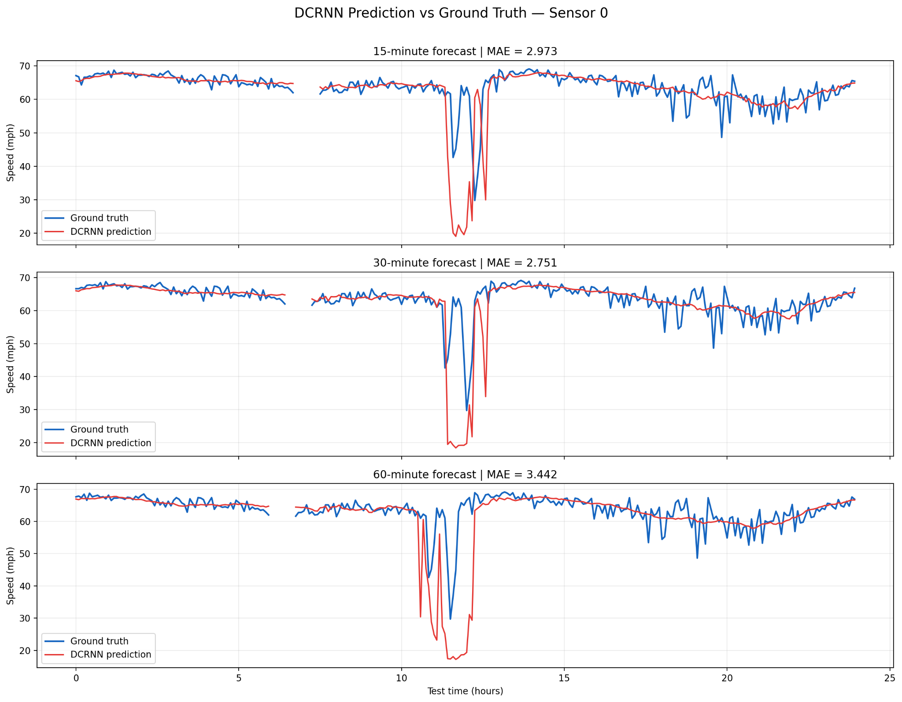

# DCRNN Traffic Forecasting Reproduction on METR-LA

This repository records a completed reproduction of the **Diffusion Convolutional Recurrent Neural Network (DCRNN)** for traffic-speed forecasting on the **METR-LA** dataset. The experiment was implemented with the [BasicTS](https://github.com/GestaltCogTeam/BasicTS) framework.

## Reproduction status

- Model training: completed for 100 epochs
- Test-set evaluation: completed
- Forecast horizons: 15, 30, and 60 minutes
- Prediction export: completed
- Ground-truth versus prediction visualization: completed and archived

## Task and data

| Item | Setting |
|---|---|
| Dataset | METR-LA |
| Traffic sensors | 207 |
| Sampling interval | 5 minutes |
| Historical input | 12 steps (60 minutes) |
| Forecast output | 12 steps (60 minutes) |
| Split | 70% train / 10% validation / 20% test |
| Training epochs | 100 |
| Batch size | 64 |
| Initial learning rate | 0.01 |

DCRNN combines recurrent sequence modelling with diffusion convolution on a road-sensor graph. It therefore learns both temporal traffic patterns and spatial dependencies between sensors.

## Test results

| Forecast horizon | MAE | MAPE | RMSE |
|---|---:|---:|---:|
| Overall | 3.0425 | 8.28% | 6.2756 |
| 15 minutes (horizon 3) | 2.6722 | 6.83% | 5.1767 |
| 30 minutes (horizon 6) | 3.0812 | 8.34% | 6.3242 |
| 60 minutes (horizon 12) | 3.5660 | 10.32% | 7.5326 |

These are full test-set metrics. The longer forecast horizon has the largest error, which is expected because uncertainty accumulates as the prediction range increases.

The original BasicTS metric output is archived in [`experiments/results/test_metrics.json`](experiments/results/test_metrics.json).

## Prediction visualization



The figure compares the 15-, 30-, and 60-minute forecasts for sensor 0 over one 24-hour test segment. Its displayed MAE values (2.973, 2.751, and 3.442 mph) are local to this sensor and time window; they do not replace the full test-set metrics above. DCRNN follows stable traffic periods closely, but its predictions are smoother around sudden speed drops and recovery.

The detailed experiment record is available in [`experiments/DCRNN_METR_LA_results.md`](experiments/DCRNN_METR_LA_results.md).

## Repository additions

```text
baselines/DCRNN/METR-LA.py          # 100-epoch reproduction configuration
baselines/DCRNN/METR_LA_TEST.py     # short compatibility test configuration
experiments/DCRNN_METR_LA_results.md
scripts/plot_dcrnn_comparison.py    # reads BasicTS memmap outputs and plots forecasts
visualizations/                     # generated figures (small figures only)
```

The full BasicTS source remains in the repository so that the experiment configuration can be run in its original framework.

## Environment setup

The reproduction was run on Windows in a dedicated Python virtual environment. From the repository root:

```powershell
python -m venv .venv-dcrnn
.\.venv-dcrnn\Scripts\Activate.ps1
python -m pip install --upgrade pip
python -m pip install -r requirements.txt
python -m pip install matplotlib
```

Prepare METR-LA using the data format required by BasicTS. The dataset and adjacency matrix must be placed under:

```text
datasets/METR-LA/
```

The dataset is intentionally not committed to this repository. See the [BasicTS getting-started guide](https://github.com/GestaltCogTeam/BasicTS/blob/master/tutorial/getting_started.md) for its data preparation workflow.

## Train the model

Run from the repository root:

```powershell
python experiments\train.py -c baselines\DCRNN\METR-LA.py -g 0
```

The main checkpoints are created below `checkpoints/DCRNN/METR-LA_100_12_12/<run_id>/`. Checkpoints are excluded from Git because they are large.

## Evaluate the trained checkpoint

Replace `<run_id>` with the folder created during training:

```powershell
python experiments\evaluate.py `
  -cfg baselines\DCRNN\METR-LA.py `
  -ckpt checkpoints\DCRNN\METR-LA_100_12_12\<run_id>\DCRNN_best_val_MAE.pt `
  -g 0 `
  -d gpu
```

With `CFG.EVAL.SAVE_RESULTS = True`, evaluation writes:

```text
test_metrics.json
test_results/inputs.npy
test_results/predictions.npy
test_results/targets.npy
```

In this BasicTS version, the three files ending in `.npy` are raw `numpy.memmap` arrays rather than standard NumPy files. They must be opened with `numpy.memmap`; `numpy.load` will fail.

## Plot prediction versus ground truth

Pass the generated `test_results` directory to the plotting script:

```powershell
python scripts\plot_dcrnn_comparison.py `
  --result-dir "checkpoints\DCRNN\METR-LA_100_12_12\<run_id>\test_results"
```

The script plots the 15-, 30-, and 60-minute forecasts for one sensor over 24 hours and saves:

```text
visualizations/dcrnn_sensor_0_comparison.png
```

Zero-valued METR-LA targets are treated as missing observations and excluded from the local plot and MAE calculation.

## Files intentionally excluded

The following files remain local and are not uploaded:

- `.venv-dcrnn/`
- `datasets/`
- `checkpoints/` and model weights (`*.pt`)
- exported prediction arrays (`*.npy`)
- cache and log files

This keeps the repository small and avoids GitHub's large-file limits.

## Acknowledgements

This reproduction is based on:

- Li et al., [Diffusion Convolutional Recurrent Neural Network: Data-Driven Traffic Forecasting](https://arxiv.org/abs/1707.01926), ICLR 2018.
- The [BasicTS](https://github.com/GestaltCogTeam/BasicTS) forecasting benchmark and toolkit.

The original BasicTS license and citation files are preserved in this repository.
